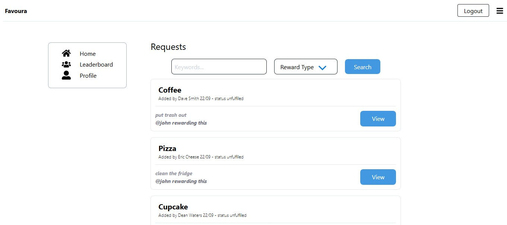

# Favoura | IOU Favour Tracker Web App Client
## Table Of Contents

* [About the Project](#about-the-project)
* [Built With](#built-with)
* [Installation and Usage](#installation-and-usage)
  * [Prerequisites](#prerequisites)
  * [Installation](#installation)
* [Roadmap](#roadmap)
* [License](#license)
* [Acknowledgements](#acknowledgements)

## About The Project



Favoura is a tracking system for “IOU”s or “favours”. An “IOU” is an abbreviation of "I owe you", and it is an informal acknowledgement of a debt or favor owed. This system allows groups or teams to log in and record the favors that they owe to each other. In addition to recording favors, Favoura allows users to post public requests with an offer to provide a favor (the reward), as well as view a leaderboard to see who is fulfilling the most requests.

## Built With

The following technologies were used to build this web app:
* React.
* TailwindCSS.
* AWS Cognito.

## Application Contents

### Src Directory
<ul> 
  <li><b>Components</b> - A directory containing the React components used in this web app.</li>
  <li><b>Contexts</b> - A directory containing the React contexts used in this web app.</li>
 <li><b>Hooks</b> - A directory containing the React hooks used in this web app.</li>
 <li><b>Views</b> - A directory containing the the main React pages used in this web app.</li>
 <li><b>Utility</b> - A directory containing commonly used functionality used in this web app.</li>
</ul>

### Utility Directory
<ul>
  <li><b>ErrorMessageUI.js</b> - Gets fed error codes, and outputs the text that is intended to be  displayed to the user. </li>
 <li><b>UserPool.js</b> - Contains user pool data intended to be used for connecting to our AWS Cognito authentication service.</li>
 <li><b>Util.js</b> - Containing commonly used functions used in this web app.</li>
</ul>
  
### App Working Directory
<ul>
  <li><b>node-modules</b> - Generated when running 'npm install'. A directory containing the NPM package dependencies used by this server.</li>
  <li><b>package.json</b> - Package.json file used with NPM.</li>
  <li><b>package-lock.json</b> - Package-lock.json file used with NPM.</li>
</ul>

## Installation and Usage

### Prerequisites

* Node.JS
* NPM

```sh
npm install npm@latest -g
```

### Installation
<ol>
  <li>Clone this repository.</li>
  <li>In the newly cloned repository, open your command line and run the 'npm install' command to download the required packages.</li>
  <li>Run the <b>'npm start'</b> command to run the server. (see the package.json for other scripts).</li> 
  <li>The Favoura front-end client is now ready. Try out the following unauthenticated REST requests below.</li>
</ol>

## Roadmap

See the [open issues](https://github.com/AryanNateq/AIP-A2-IOU-Tracker-Server/issues) for a list of proposed features (and known issues).

## License

AIP-A2-IOU-Tracker-Server is copyright (c) 2020, Aryan Nateghnia <38933061+aryannateq@users.noreply.github.com>.

## Acknowledgements

* [Sukonrat Kanjanasuttiyakorn](https://github.com/sukonrat)
* [Mohammad Karim](https://github.com/mohammad260)

